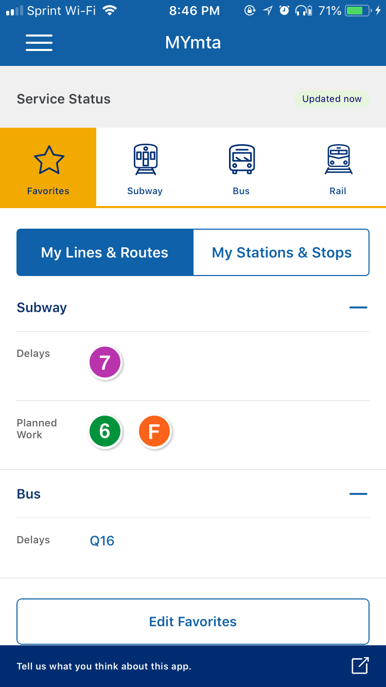

(Version 0.9.3 - 6)
Written 9/11/18

## Problem scenario: 

*Disclaimer: This case study is a personal academic exercise and shouldn’t be consulted as a serious UX strategy. In lieu of conducting user research, I note my own usage and user scenarios of the app to justify the following critique.*

### Prompt:

As a daily commuter on New York City’s public transportation, I want to check the most up-to-date arrival times for the subway and bus stations I’m departing or transferring from.

Whether I’m going to school or the arcade, I check bus and train arrivals in advance. If I’m leaving home, this is usually so I may plan my departure. If I’m waiting for a train or a bus, this is so I can expect the next arrival (or reroute if necessary). Either way,  checking the arrival times gives me peace of mind at best, or the knowledge to recalculate my commute at worst.

### About the user (myself):

I’m a born-and-raised New Yorker. However, I live in a suburb of Queens about 2 miles removed from the closest subway station (the 7 train), which is only accessible via bus. Since high school, I’ve dealt with a very small margin of error in commute times: missing a single (usually bus) arrival could mean arriving up to 20 minutes late to class. 

Two years ago, while I was living in my school’s dorm in Manhattan, I began commuting via bike as one way to sidestep this issue. However, because of varying weather conditions (and an unfortunate crash back in June :( ) my main method of transportation remains the bus and subway.

(I’ve also historically been a pretty bad procrastinator and lazy student—which doesn’t help my tendency to be late.)

### NYC public transit UX stinks, but MYmta helps a lot

The MTA’s notoriously poor service efficiency has always been a pain point for New Yorkers, and [it’s only getting worse](https://www.nytimes.com/2018/03/19/nyregion/new-york-subways-on-time-performance-hits-new-low.html). While I, with an unusually low standard for mercy, tend to cut the MTA some slack for its service, I do feel for my fellow city commuters who are familiar with the bitter taste of frustration toward the frequent subway delays. Delays are probably at the top of a list of reasons why [customer satisfaction with the NYC subways declined](https://www.amny.com/transit/mta-subway-survey-riders-more-unhappy-with-service-1.11132038) in 2015, others including crowded trains, dirty stations, and high fares.

That said, for all of the issues with the the public transit user experience, I think that the MTA’s [recently released MYmta app](http://www.mta.info/sites/default/files/pdf/17mtah196_landingpage_r9_english.pdf) and [responsively designed website(!)](https://new.mta.info/) are steps in the right direction. I conjecture that having arrival information visibly available, whether on an app or on physical countdown clocks or touchscreens in a station, provides a major boost to riders’ satisfaction. According to Charles Seaton in an article written about [then-newly-installed countdown clocks](http://www.metro-magazine.com/rail/article/715387/nyc-transit-uses-new-tech-tests-real-time-train-arrival) in 2016, the clocks

> take the guesswork out of waiting for a train, offering a reduction in stress levels for harried New Yorkers. The clocks are arguably the most welcome innovation to the New York City subway…

Before MYmta app, the official digital solutions to the information game were sloppy at best. I personally used third-party apps such as Citymapper and Google Maps to find bus and train arrival information. (With Google Maps in particular, I’ve used the “find directions” function not for its intended fashion, but because it could display arrivals for public transit much more clearly and delightfully than on the MTA’s own website.) I’ve also considered taking a picture of or printing out bus schedules with my phone and printing them out for easy access. 

Now, the MYmta app is convenient as a designated tool to help me plan and anticipate daily commutes on public transit, without having to open a less specialized third-party app or task (i.e. Google Maps).

That being said, the myMTA app, while a nice pill of aspirin to the headache that can be the MTA, does have its UX issues here and there. In this case study, I’ll review and recommend changes for a particular task in the app: checking arrival times for trains and buses. 

## Current solutions/behaviors:

*Disclaimer reminder: The following user scenarios are modeled off of my own notes of how I use the app and are not a replacement for user testing.*

### The task: finding arrival times for trains and buses

I like to check for arrival times for peace of mind. I usually know in advance which route I want to take to get somewhere; for instance, on my commute to school, I know that I want to make sure that the F train is arriving to and from the Jackson Heights - Roosevelt Avenue station on time. At stations that I visit less frequently or without reliable or visible arrival info displays (e.g. countdown clocks) such as East Broadway, I would like to know how long I’ll be waiting on the platform rather than wait anxiously for the train to arrive at any minute.

When I’m checking for an arrival time, I navigate to the **Service Status** section on the MYmta app’s home screen:

 
*Screen A: Home screen: Service Status - Favorites - My Lines & Routes*

The information displayed here is fairly straightforward. I tap train or bus names to check the current status of my favorited subways and bus lines.

One issue that’s been bugging me more often is how “Updated now” isn’t a descriptive enough label for the status of the information. I’ve noticed that the service status info doesn’t immediately update upon launching the app, causing me to rely on outdated information about service changes.

I want to find arrival times for the F train at Jackson Heights - Roosevelt Avenue, I tap the F line icon. I scroll to the section “Stations” to find the station I’m at and want to find out arrival times for. Jackson Heights - Roosevelt Avenue is at the bottom!

*Screen B: Service Status - F Line Subway Details*

I tap the station and it brings me to the list of arrivals.

*Screen C: Station Details (Jackson Heights - Roosevelt Avenue)*

And that’s it! This is how I usually check for subway arrival times. While it’s not super efficient, requiring me to navigate three screens, I’ve found the information I’m looking for. The pathway is relatively straightforward and requires little thought on my part.

When I’m checking bus times, however, the experience is a little different&mdash;in fact, this is where my main problems happen. Unlike the Subway Details screen, the Bus Details screen doesn’t provide a list of stops along the saved line.

*Screen D: Bus Line Service Status (Q16)*

Presumably, the stops that would then show up on this screen are stops that I’ve saved using the “Favorite” feature in the app. As implied by the Service Status screen, subway/bus lines or specific subway/bus stops can be favorited.

However, the Bus Details screen doesn’t provide context for which stops are displayed&mdash;it simply says “Stops”. This would be fine if it displayed my favorited stops, but it doesn’t always do so&mdash;sometimes the stops displayed differ depending on the time of day or my location. Based on what I’ve seen, my best hunch is that the stops displayed are my favorited AND nearby stops.

As a user, this vague information makes me feel confused and frustrated when checking the app. It’s not clear what I’m looking at and I wish I knew exactly what stops are displayed.

If I don’t find the information I’m looking for (usually for the bus), I check “My stations & stops”
From the Service Status screen, I tap on the My Stations & Stops tab so I can, in fact, find arrival times of subways or buses at particular stations/stops. I see a listing of different stops, all of which I’ve favorited in the past.

*Screen E: Service Status: My Stations & Stops*

I tap a button to find out arrival times at that stop. However, tapping the button does nothing…

*Screen E.5: Service Status: My Stations & Stops (extended)*

...until I tap the plus button on the side. I literally JUST realized that while taking screenshots of the app for this case study. When I used this app in the past, the apparent non-interactivity (and telegraphed uselessness) of the cards was frustrating. I used to assume that the plus button served some other purpose, such as adding another line’s arrival information to the stop. Now I feel dumb for not having noticed this earlier.

My issue here lies in how the cards telegraph their interactivity. According to the [Material Design guide](https://material.io/design/components/cards.html#actions), cards generally permit a primary action by tapping on the card body itself or a supplemental action via additional icons or text.

The primary action of interacting with these cards should be to reveal arrival times. However, that information is not available by tapping on the card body, but by tapping on an icon&mdash;which, as stated, suggests a *supplemental* action. Thus, the visual hierarchy of card actions is reversed.

Additionally, here’s a video of the transition from Screen E to Screen E.5. Note the lack of an indication to whether the card expands as well as the lack of animation. It’s another interaction issue that can possibly add confusion while using the app.

### Other conveniences and considerations

I wish there was an option to view a whole bus schedule in advance. Bus times are usually a bit more predictable than subways, or at least I judge that to be true since bus arrival schedules are posted at every stop. They’re convenient if I don’t have a departure time set in stone.

There are two alternative solutions to finding arrival times on the home page of the app. Both are ineffective for the specific user scenario of a frequent commuter who’s trying to quickly access arrival times while en route. As a result, they add additional cognitive laod 

One possible solution is the **trip planner**. The trip planner takes several pieces of input, including a departure point and destination, and provides a route using public transit with anticipated arrival times for each line. It’s the MTA’s answer to Google Maps. 

However, the trip planner’s design doesn’t align with the user scenario I described. The scenario involves a frequent commuter who is trying to quickly access arrival times while en route. The travel planner anticipates a whole journey beforehand. The feature feels like it’s intended for for more deliberate routing, such as planning a trip for a job interview or finding my way to a part of the city I’ve never been to before. It feels like more work than I need on an average day&mdash;I’m not usually trying to get exact directions; I just want to know when’s the next train.

Another solution to the arrival time issue is the **Nearby Stations & Stops** function. Similarly to the trip planner, this function misses the goal of my specific user scenario. It requires the user to manually search for arrival information by scrolling through a list of nearby stations and stops. This might be helpful for a user who is unfamiliar with the location of local lines, but for a veteran commuter, this function is also far more cumbersome than being able to access arrival information via saved stops.

It follows that, in order to solve this user scenario, we’ll have to redesign the favorites screen. It’s the most efficient way for users to access arrival information.

## Solutions

I think the current information structure on the Service Status section is good. Here’s how it’s represented as a list:

* Service Status
  * Favorites / Subway / Bus / Rail
    * My Lines & Routes / My Stations & Stops
      * Subway
          * Delays/Service Change
          * Planned Work
          * Good Service
      * Bus
          * Delays/Service Change
          * Planned Work
          * Good Service
    * My Lines & Routes / My Stations & Stops
      * Stop [Route]
          * [Route] Terminus
          * Later scheduled services at [time, ...]

I believe the issue seems to be largely grounded in UI/interaction design. All of the required information seems to be present and organized in the right sections; I just can’t easily access it, or it could be presented much more clearly.

### Proposed changes:

To mock up these changes, I used Adobe XD for the wireframes and After Effects for the animation.

Screen A:

Add a refresh button option for the updates to give the user more control over showing the most updated information. Show a loading indicator when new information is being fetched (not pictured).

Change the indication from “Updated now” to something more specific, such as “Updated [now/x minutes ago] at [time]”. This clearer signalling of when the app last fetched information resolves any ambiguity about whether the app is loading new service data.

Extra:
I would suggest changing the “Favorites” label to a more personalized title such as “My stations & lines”. I’d conjecture that a more personal label creates a stronger mental association between the user and information that is individually important to them.

Screen B:
No changes. I see in the new update that there’s bus arrival locations now, which is great!

Extra:
I might add a marker next to each stop showing where the current trains in service are arriving next at this time. The MTA signal system doesn’t show individual train locations, but it still has estimates for which trains will arrive at which times. For example, at 8:00pm, which stop will be receiving the next train?

Screen C:

No changes. This is the subway information I’m looking for.

Screen D:
Change “Stops” to “Saved Stops” or “My Saved Stops” to make the association clearer.
I’m assuming that this screen shows nearby stops only, however. In that case, I would change the heading to something to reflect that, such as “My Nearby Saved Stops”.

I would also change the station name to the actual name of the nearby station. The name displayed on this screen is actually the name of the terminal station of the line. This poses a problem especially when the terminal station is one that I actually frequent - I could mistakenly assume that the times displayed here are actually those for the station located at 39 Av/Union St.

Screen E:
The card design of the stations is problematic because the card design implies a certain type of behavior: user tap interaction. Tapping anywhere on the card should manipulate the entire thing: in most cases, expanding to show more information; others, taking the user to another link.

Otherwise, I might remove the shadow effect.

If I were in the team’s position, a solution that would most likely work is simply changing the minus icon to a caret (v). This makes it much clearer to the user that there is expandable information.

Oddly, the subway terminus information does show the terminal borough as well as the terminal station. This is less ambiguous if you’re a frequent subway user, but I think it would reduce cognitive load to identify the terminus station&mdash;either by changing the label to “To [terminal] or “[terminal]-bound”.

## Reflection
In which assumptions lead to admiration

I presume that the app is built on a very simple design platform. There aren’t any transition animations present between different screens or states. In fact, all element interactions have only static, instant transitions. The interface seems very web-like in that respect, and I assume that the app is on an extremely simple, web-like design platform. There could be any number of explanations for this; my current conjecture is that the team has a limited budget to work with.

While some designers might scoff at the simplicity of the design, I actually am pleasantly surprised by the how the app otherwise has a great user experience. For what it’s worth, I think the design of this app is clear and pleasant to use (let alone a million times better than the design of the old MTA service and arrivals website). Information on service status is laid out in a generally accessible, clear fashion.

Another good sign for the app is how the MYmta team seems to be aggressively pursuing user feedback, whether via reminders on the app itself or on subway ads for the app. I wouldn’t say the MTA is well-regarded for its transparency with customers&mdash;take the classic generic announcement “we are delayed because of train traffic ahead of us”&mdash;so I think this strategy is a step in the right direction for building trust and improving the UX on the customer service side. 

While I think the app has lots of room for improvement, it’s still a great step for NYC commuters and reminds us that UX design can be successful without loads of fancy visuals and animations.

